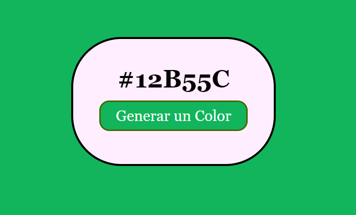

#  Generador de Color

<h2>Proyecto #1</h2>

<h3> Generador de codigo Hexadecimal: </h3>  

Al realizar un click en el boton tendremos un nuevo color y un nuevo codigo 

## 🛠 Skills
Javascript, HTML, CSS.
## 🔗 Links

## 📜 License

[MIT](https://choosealicense.com/licenses/mit/)