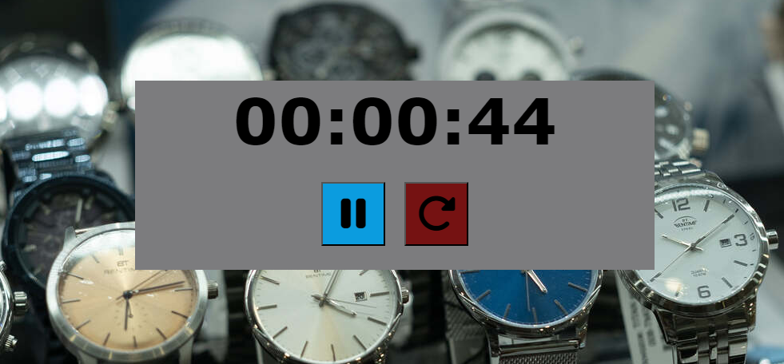

#  🕐 Cronometro

<h2>Proyecto #2</h2>

<h3> Cronometro de tiempo: </h3>  

realiza la funcion de Inicia, Pausa y Reanudar el temporizador con los Botones de:
1. Boton de play ▶️
2. Boton de pausa 
3. Boton de Reiniciar 🔁

## 📜 License

[MIT](https://choosealicense.com/licenses/mit/)