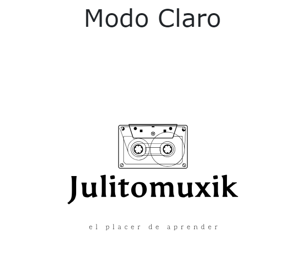
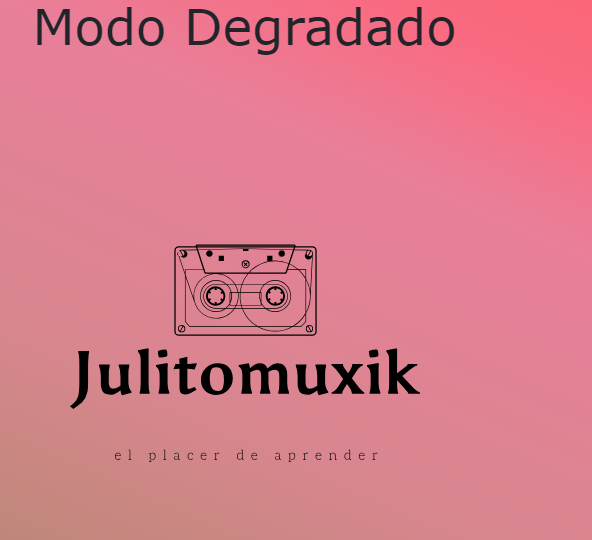
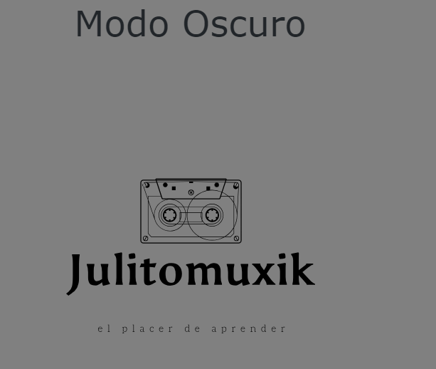

# Modo de Pagina

Creando una pagina en la cual hay 3 botones que cambian el fondo de pantalla 

<h2>Proyecto #3</h2>

- 

-

-

## 🛠 Skills
Javascript, HTML, CSS...
## 🔗 Links

💖Like my work?

📜 License

[MIT](https://choosealicense.com/licenses/mit/)